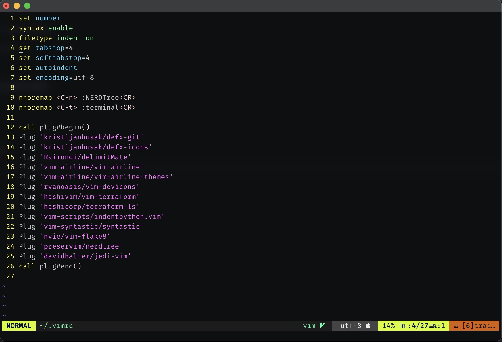

# dotfiles

A collection of my personal dotfiles

## Font

```
https://github.com/ryanoasis/nerd-fonts
```

# iTerm2 theme
https://github.com/herrbischoff/iterm2-gruvbox

## Screenshot

<p align="center">
  
</p>
